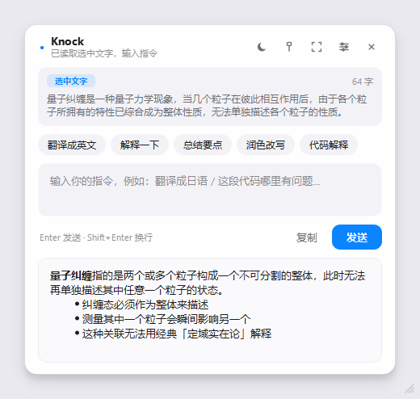
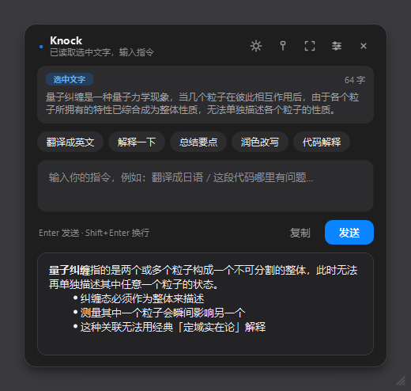
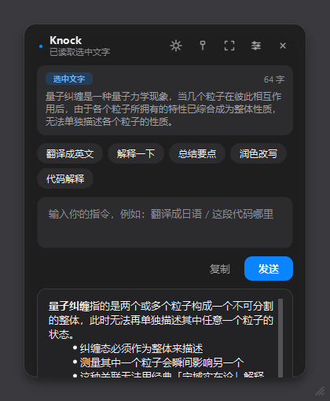
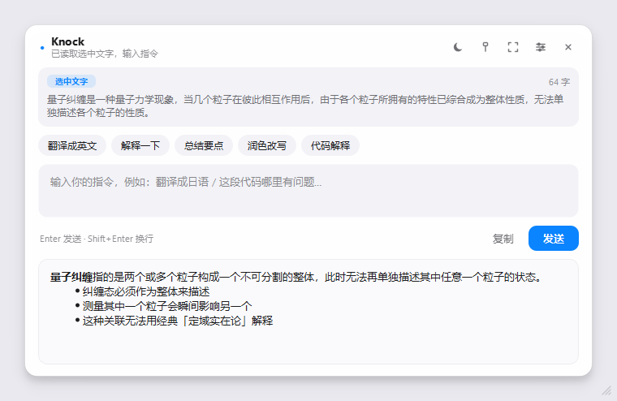
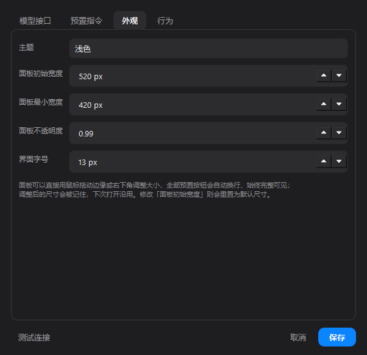

# Knocknock — Select text or grab a screenshot, ask a large language model

A small Windows desktop utility: **select text anywhere on screen, or drag a box around a region, press Alt twice, type an instruction in plain language — the answer appears in a floating panel.**

The interface borrows macOS / iOS design language: a borderless rounded card, a soft drop shadow, system-blue accents, and rounded chip buttons. It supports always-on-top, free resizing, a **Chinese / English interface toggle**, and light / dark themes.



| Dark theme | Narrow panel (chips wrap, none are dropped) |
| --- | --- |
|  |  |

| Wide panel | Settings dialog (Appearance) |
| --- | --- |
|  |  |

> The images above are real interface renders produced by offscreen painting; they live in `screenshots/`.

---

## 1. Features

| Capability | Description |
| --- | --- |
| Text-selection Q&A | Select text with the mouse in any application, press **Alt twice**, and the panel opens with the selection loaded |
| Double-Alt toggle | When the panel is already open, **pressing Alt twice again hides it**. You can turn this off in Settings and go back to "always re-read the selection" |
| Screenshot region | **Ctrl + Alt + A** (or the tray menu) opens a full-screen overlay; drag to select any region, with a pixel magnifier and live size readout |
| Screenshot sizing | The panel grows around the captured picture instead of squeezing it — but the preview is **capped at 400 px wide** (default 320 px), with small / medium / large under Settings → Appearance |
| Prompt input | Type freely in the panel's input box, or click a preset chip (Translate / Explain / Summarize / Polish / Explain code) |
| Follow-up questions | Keep asking about the same selection; the conversation context is preserved |
| Streaming answers | Text appears token by token and can be stopped at any time; results render Markdown and copy in one click |
| Free resizing | Drag the panel edge or the bottom-right corner. **Every preset chip wraps automatically and stays fully visible**, the title bar is **pinned to the top of the card**, and the size is remembered |
| Chinese / English UI | Settings → Appearance → Interface language switches everything at once — panel, tray menu, settings dialog, capture hints, and model error messages. Presets are stored separately per language |
| Light / dark theme | One-click toggle in the title bar, or follow the system. Changing it in Settings previews live |
| Always on top | The pin button in the title bar toggles it; the panel can be dragged anywhere |
| Model backends | OpenAI-compatible protocol (OpenAI / DeepSeek / Qwen / Kimi / Zhipu / Ollama …) plus Anthropic Claude |
| Separate text / vision models | Text questions and screenshots can use different models (`deepseek-chat` for text, `qwen-vl-max` for pictures); one model can still do both |
| Vision Q&A | A screenshot is sent to the model as an image (gpt-4o, qwen-vl-max, glm-4v …) |
| Generous output budget | 4096 output tokens by default, so long answers are not cut off mid-sentence; set it to 0 to let the server decide |

---

## 2. Getting started

### 2.1 Install dependencies

```bash
cd D:\AI\Knocknock
python -m venv .venv
.venv\Scripts\activate
pip install -r requirements.txt
```

> The default install is `PySide6-Essentials` (~60 MB, only QtCore / QtGui / QtWidgets — enough for this project).
> For the full package, replace the first line of `requirements.txt` with `PySide6>=6.6.0`; no code changes are needed.
> On a slow connection in China, add a mirror: `pip install -r requirements.txt -i https://pypi.tuna.tsinghua.edu.cn/simple`

### 2.2 Launch

Double-click `run.bat` (it creates the virtual environment if needed, then starts the app), or run:

```bash
.venv\Scripts\pythonw.exe main.py
```

> Use `pythonw.exe` to avoid a console window. During debugging, run `python main.py` so you can see the logs.

### 2.3 Configure the API key

On first launch, right-click the Knocknock icon in the system tray → **Settings…** → fill in `Base URL`, `API Key`, and the model(s), click **Test connection** to confirm, then save.

There are two model fields: **Text model** for typed questions and **Vision model** for anything carrying a screenshot. Leave the vision model empty and one model does both jobs.

You can also edit `config.json` directly with a text editor (it is generated on first run):

```json
{
  "api": {
    "provider": "openai",
    "base_url": "https://api.deepseek.com/v1",
    "api_key": "sk-your-key",
    "model": "deepseek-chat",
    "vision_model": "qwen-vl-max",
    "max_tokens": 4096
  }
}
```

Reference values for common providers:

| Provider | Base URL | Model examples |
| --- | --- | --- |
| OpenAI | `https://api.openai.com/v1` | `gpt-4o-mini`, `gpt-4o` (vision) |
| DeepSeek | `https://api.deepseek.com/v1` | `deepseek-chat` |
| Alibaba Qwen | `https://dashscope.aliyuncs.com/compatible-mode/v1` | `qwen-plus`, `qwen-vl-max` (vision) |
| Moonshot | `https://api.moonshot.cn/v1` | `moonshot-v1-8k` |
| Zhipu | `https://open.bigmodel.cn/api/paas/v4` | `glm-4-flash`, `glm-4v` (vision) |
| Local Ollama | `http://localhost:11434/v1` | `qwen2.5:7b` |

> **Note:** screenshot Q&A requires a model that accepts image input. With a text-only model, use text selection instead, or switch to a vision model (`vl` / `4o` / `4v`).

---

## 3. Controls

| Action | Effect |
| --- | --- |
| Select text, then press **Alt twice** | Read the selection and open the panel |
| Press **Alt twice** while the panel is open | Hide the panel (can be disabled under Settings → Behavior) |
| **Ctrl + Alt + A** | Enter screenshot-region mode |
| **Ctrl + Alt + Q** | Same as pressing Alt twice |
| **Enter** in the panel | Send |
| **Shift + Enter** | New line |
| **Esc** | Hide the panel / cancel a capture |
| Drag the panel **edge or bottom-right corner** | Resize (it cannot be dragged smaller than the content, and the size is remembered) |
| Click the **moon / sun** icon in the title bar | Switch dark / light theme |
| **Double-click the left button** while capturing | Capture the whole screen |
| **Right-click / Esc** while capturing | Cancel |
| Click the tray icon | Show / hide the panel |
| Tray menu → **Close panel** | Dismiss the floating panel |
| Settings → Appearance → **Interface language** | Switch between Simplified Chinese and English (applies after saving) |

> **Why Alt and not Ctrl?** Ctrl is held down to multi-select files in Explorer and for a great
> many editing shortcuts, so a stray double press is easy to produce by accident. A bare Alt tap
> is comparatively rare.
>
> The trade-off: Windows normally uses a lone Alt press to open an application's menu bar (the
> system menu, or the ribbon in Explorer). Double-tapping Alt may therefore flash that menu.
> Knocknock only observes the key — it never swallows it — so this cannot be suppressed without
> breaking ordinary Alt usage everywhere.
| Settings → Appearance → **Screenshot size** | How wide the captured preview may be: small 240 px / medium 320 px / large 400 px (hard ceiling) |

---

## 4. Project structure

```
Knocknock/
├── main.py                    # Entry point: tray, hotkeys, wiring the modules together
├── run.bat                    # One-click launcher
├── pyproject.toml             # Packaging metadata and dependencies
├── requirements.txt
├── LICENSE                    # MIT
├── config.example.json        # Template with default configuration
├── config.json                # Your configuration (generated on first run, git-ignored)
├── packaging/
│   ├── build.bat              # One-command build -> dist\Knocknock.exe
│   ├── knocknock.spec         # PyInstaller build definition
│   └── make_icon.py           # Generates packaging\knocknock.ico from the vector icon
├── screenshots/               # Interface previews
├── tests/
│   └── selftest.py            # Self-test script (18 groups, no network access)
└── knocknock/
    ├── __init__.py            # Package version
    ├── i18n.py                # Chinese/English string tables + language state (t() / text())
    ├── config.py              # Config load/merge, presets stored per language
    ├── theme.py               # Two Apple-style palettes (light/dark) + QSS generation
    ├── winapi.py              # ctypes wrappers: SendInput / clipboard sequence / hotkey parsing
    ├── hotkey.py              # Global low-level keyboard hook + RegisterHotKey (own thread loop)
    ├── selection.py           # Text grab (simulated Ctrl+C + clipboard comparison)
    ├── capture.py             # Full-screen overlay, magnifier, cropping, PNG encoding
    ├── llm.py                 # OpenAI-compatible / Anthropic calls with streaming parsing
    ├── widgets.py             # Flow layout, vector icons, rounded thumbnails, shrinkable labels
    ├── panel.py               # Main floating panel (core UI: resize / theme / language / streaming)
    └── settings_dialog.py     # Settings dialog
```

---

## 5. How the Chinese / English switch works

Qt's built-in `QTranslator` needs the `lupdate` / `lrelease` toolchain to produce `.ts` / `.qm` files, which is heavy for a project this size. Instead this project uses **string dictionaries plus a `t()` function**:

```python
from knocknock import i18n

i18n.set_language("en")                  # switch language
i18n.t("panel.button.send")              # -> "Send"
i18n.text("llm.system_prompt", "zh")     # look up a specific language (defaults to current)
```

A few conventions:

- **The tables live in `knocknock/i18n.py`.** The `_ZH` and `_EN` dictionaries must have exactly matching keys — self-test group 14 asserts this and fails loudly on a missing translation.
- **Missing keys fall back step by step:** current language → Chinese → the key itself. A missing translation degrades to a visible key rather than a crash.
- **The UI is re-translated in place, not rebuilt.** The panel exposes `retranslate()`, which resets every label, tooltip, and preset chip to the new language. The settings dialog is constructed fresh each time it is opened, so it simply builds with the current language.
- **Presets are stored per language:** `presets` (Chinese) and `presets_en` (English). Switching language reads the matching set without overwriting the other. The settings dialog edits the set belonging to the language that was active when the dialog opened, so switching languages cannot clobber the other copy.
- **The system prompt follows the language.** In `config.py`, `_normalize()` checks `api.system_prompt`: if it is empty, or equal to any built-in default (meaning the user never customized it), it is replaced with the default prompt for the current language. Text the user actually wrote is never touched.
- **Startup order matters:** `main()` calls `i18n.set_language(cfg...)` before creating any UI object, otherwise the first frame renders in the wrong language.

To add a third language, add one dictionary in `i18n.py`, register it in `LANGUAGES` / `LANGUAGE_LABELS`, and add a `PRESETS_<LANG>` entry in `config.py`.

---

## 6. Self-test

After changing code, run the bundled self-test. It covers configuration, hotkey parsing, message
construction, theming, the UI flow, screen capture, clipboard text grabbing, tray-icon uniqueness,
panel resizing, shadows and tooltips, the Chinese/English switch, the pinned header, double-Alt
closing and detection, screenshot growth, the output token budget and the text/vision model split —
plus LLM calls against a local mock server, so no quota is consumed:

```bash
.venv\Scripts\python.exe tests\selftest.py
```

Expected output:

```
--- 1. Config loading and merging ---
  [pass] config read / defaults filled in / dotted access
...
--- 14. Chinese/English switching ---
  [pass] string tables / panel retranslation / per-language presets
--- 15. Pinned header and double-Alt closing ---
  [pass] header stays at the top (does not move when the window grows)
  [pass] double-Alt toggles the panel + tray close entry
  [pass] Alt pair fires; Alt+key and Ctrl do not
--- 16. Screenshot growth ---
  [pass] a new picture grows the panel into view step by step
--- 17. Output token budget ---
  [pass] default is generous / 0 means server decides / nonsense is repaired
--- 18. Text / vision model split ---
  [pass] screenshots use the vision model / preview tiers are respected
Passed 23, failed 0
All self-tests passed.
```

> Group 9 briefly creates a tray icon (hidden again when the test finishes); the other cases do not disturb the desktop.
> The self-test redirects all config writes to a temporary file and never touches your `config.json`.

---

## 7. Implementation notes

**1. How is a double Alt detected?**
`hotkey.py` installs a low-level keyboard hook with `SetWindowsHookExW(WH_KEYBOARD_LL, ...)`, running on its own thread's message loop (no administrator rights required). The rules:

- Pressing Alt records a timestamp and enters the pending state.
- Pressing Alt again within `double_alt_interval_ms` (420 ms by default) fires the event.
- Any other key press in between cancels the pending state, so combinations such as **Alt+Tab and Alt+F4 never trigger it by accident**.
- Synthetic key events carrying `LLKHF_INJECTED` are ignored, which prevents the app's own Ctrl+C from causing a feedback loop.
- `VK_MENU`, `VK_LMENU` and `VK_RMENU` all count, so either physical Alt key works — and the two can be paired with each other.
- Alt combinations arrive as `WM_SYSKEYDOWN` rather than `WM_KEYDOWN`, so the hook accepts both message types. Ctrl is no longer a trigger at all.

The hook callback only decides; the real work is handed back to the main thread through a Qt signal (a queued cross-thread connection).

**2. How is the selected text retrieved?**
Windows has no public API for reading another application's selection, so the usual approach is to simulate `Ctrl+C`: record `GetClipboardSequenceNumber()`, send Ctrl+C, poll until the sequence number changes, then read the clipboard. If it never changes, the user had nothing selected, and the app falls back to whatever image or text the clipboard already held.

**Ordering matters:** the content must be captured *before* the panel is shown — once the panel takes focus, the target application's selection is gone.

**3. Capture coordinates on high-DPI screens**
The whole virtual desktop from `virtualGeometry()` is stitched into one large image in device pixels, and the overlay window covers the virtual desktop. The selection rectangle is drawn in logical coordinates and converted through `devicePixelRatio` when cropping, so at 125% / 150% scaling the screenshot is neither blurry nor misaligned.

**4. How is the Apple-style look achieved?**
- The top-level window uses `WA_TranslucentBackground` with no frame; inside it a `QFrame#Card` paints the rounded background, wrapped in a `QGraphicsDropShadowEffect` for the soft shadow.
- All styling lives in the QSS built by `theme.py`: system blue `#0A84FF`, secondary grey `#F2F2F7`, corner radii of 11–16 px, and borderless buttons that grey out on hover.
- Icons are not image assets — they are drawn as vectors with `QPainter` (`widgets.glyph_icon`), supersampled 2× for crisp edges and easy recoloring.

**5. Always on top**
The window flags include `WindowStaysOnTopHint`. Toggling the pin button calls `setWindowFlags()` again and then `show()` — changing flags hides the window in Qt, so it must be re-shown.

**6. High-DPI displays (125% / 150% scaling)**
Screen capture stitches the virtual desktop into one large image in **device pixels** (with no dpr set), draws the selection in logical coordinates, and multiplies by the dpr when cropping. This sidesteps the coordinate ambiguity of `QPixmap.copy()` when dpr is not 1, so screenshots are neither blurry nor offset.

**7. How does the panel keep every chip visible at any size?**
- The preset chips live in a custom `ChipBar`, which on every width change recomputes the row count via `FlowLayout.heightForWidth()` and then `setFixedHeight()` to **exactly what the buttons need** — never clipped, never wasting vertical space.
- The panel uses the default `SetDefaultConstraint` so the minimum size is derived from the layout, and `resizeEvent` clamps once more against `layout().minimumSize()`. It is therefore **impossible to drag it smaller than its content**.
- The result area is the only stretchable item (`stretch=1`): growing the window makes it taller; shrinking presses on it first, while everything else keeps its size.
- Long pieces of text such as the subtitle and the hint line use `ShrinkableLabel` (whose `minimumSizeHint` is relaxed to 0); otherwise they would force a large minimum width. On a narrow panel the long string is swapped for a short one ("Selection loaded, type an instruction" → "Selection loaded").
- Resize hit-testing happens in the shadow margin (18 px) for edges and corners, together with the three diagonal grip lines at the bottom right. A size the user has dragged is stored in `ui.last_size` and restored on the next launch.

**8. How is theming organized?**
`theme.py` defines a `Palette` dataclass plus two constant instances (light and dark); `build_qss()` assembles the entire stylesheet from the palette, and `palette()` returns the active one. Every hard-coded color now comes from the palette — there are no global color constants left.
Three things to watch:

- **Icon colors are baked into the bitmap**, so switching theme requires regenerating them via `glyph_icon()` (`panel._refresh_icons()`). `glyph_icon(color=None)` defaults to the current theme color, which keeps the default argument from being evaluated once at import time.
- **Every place that uses a color must pull its text color from the palette explicitly.** The trap that was hit: `QToolTip` had a theme-aware background but its text color was hard-wired to `text_primary`, producing dark-on-dark in the light theme with a contrast ratio of 15 — completely unreadable. `Palette` now has dedicated `tooltip_bg` / `tooltip_text` / `tooltip_border` fields.
- `QDialogButtonBox` overrides the stylesheet of its child buttons (`#Primary` / `#Ghost` stop working), so the settings dialog lays out its button row manually with a `QHBoxLayout`.

**9. Why re-translate the panel instead of reopening it?**
The panel is a long-lived object (hotkeys must always be able to summon it), so it cannot be destroyed and rebuilt just to change language. `panel.retranslate()` therefore handles strings in two categories: **stateless** ones (title, buttons, tooltips, placeholders) are set directly; **state-dependent** ones (subtitle, context badge and word count, preset chips) are recomputed by `_refresh_context_view()` / `_rebuild_chips()` from the current context. Switching language therefore never loses the loaded selection or a generated answer.

**10. The shadow margin must exceed the shadow's actual reach**
A `QGraphicsDropShadowEffect` paints outside the card; if the window is too small it is **cut off by the window edge into a hard line** (it looks like a dark ring around the panel).
In Qt the nominal `blurRadius` and the real reach are not the same thing. Measured: `blur=38 + offsetY=10` reaches about 42 px. The current values are `blur=26 + offsetY=7` (about 19 px reach) with a 30 px margin, leaving slack on all four sides. Self-test group 12 scans the outermost ring of the window and asserts its alpha is 0, so changing these numbers cannot silently regress.

**11. Why is the title bar pinned to the top?**
The trap that was hit: the result area (`QTextBrowser`) does not participate in layout while **hidden**, so at that moment the card layout contains **no item with a stretch factor at all**. Qt then distributes the surplus vertical space **evenly into the gaps between items**, which shows up as "the taller the panel, the further down the title bar and input box drift".

The fix wraps the entire top block (title bar / context / preset chips / input / action row) in a dedicated `top` container and appends **`addStretch(1)` at the end of that container**: all surplus space lands in that elastic gap, so its children always start at the top. The card layout still has only the result area as a stretchable item (`stretch=1`), so when the window grows it is the result area that grows while the trailing gap absorbs the remainder — the top content does not move a pixel. Self-test group 15 asserts `header.y() == 0` at several heights.

**12. Why make double-Alt a toggle?**
The double-press detection in `hotkey.py` (`GlobalInput.double_alt`) is global by nature and does not know whether the panel is visible, so "closing" is merely a branch in the main thread: if the panel is visible → `hide_panel()`; otherwise → grab the selection and open the panel as usual. It is a setting (`behavior.toggle_on_double_alt`) rather than hard-coded behavior because "double-Alt re-reads the selection" is a legitimate workflow for people who select text repeatedly — both habits are supported, with close-on-double-Alt on by default.

**13. How does the panel grow around a screenshot?**
The panel is sized *from* the picture, not the other way round. `_image_display_size()` fits the picture into a preferred box — **small / medium / large** under Settings → Appearance, `medium` (320 px wide) by default — and only then does `_start_reveal()` animate a single 0→1 progress value, re-deriving the picture size, the context block and the window around it on every frame. Three things are worth knowing:

- **The width has a hard ceiling of 400 px** (`IMAGE_MAX_WIDTH`), applied after the tier lookup and again in `_image_box()`. A screenshot is context for the question, not an image viewer: the first version sized the preview from the picture's own resolution, which turned a capture into a 1094 px-wide window across half the desktop. The ceiling is enforced in code rather than by picking small numbers, so no tier — and no hand-edited `config.json` — can creep past it.
- **The box, not just a height cap.** A height-only limit lets a wide capture keep its full width and leaves the panel as a mostly empty frame; a tall one then has to be squeezed by the width instead. The preference is a box, and the picture is scaled down to fit inside it (never up, except to `IMAGE_MIN_WIDTH` so a tiny capture stays legible).
- **The chrome height is computed from layout constants, not measured.** If it were measured from the current window it would depend on the panel's own size, and the first estimate would feed back into itself (the panel grows → the chips re-wrap → the estimate changes → the panel grows again). The chrome figure is also what caps the preview on a short screen, so the panel can never grow past the bottom edge of the display.
- **The picture is scaled once, up front.** The full-resolution screenshot is baked down to its final display size, and the animation only re-scales that already-small pixmap — which is what keeps an animated resize affordable (measured: ~9 ms per frame including the repaint and the shadow, so a 760 ms animation has plenty of headroom).

The window is only ever as small as its content: the interpolation is clamped by `layout().minimumSize()` on every frame, so the picture can never be clipped mid-animation, and `_clamp_to_screen()` moves the panel up as it grows downwards. The panel also narrows again for a small picture — "fit the window to the picture" cuts both ways, and a 2235 px-wide panel showing a 200 px thumbnail looks broken. Changing the preview size in Settings re-fits a picture that is already on screen, with the same animation.

One rule keeps this from being annoying: **a picture-fitted size is never remembered as the user's own.** `_remember_size()` saves the size on hide only while `_user_size` (the size the user actually dragged out) still matches the window; otherwise a single capture would silently redefine the panel size that gets restored on the next launch.

**14. Why is the output token budget 4096 by default?**
1200 was too small: long explanations were cut off mid-sentence, and a reasoning model spends the budget on `reasoning_content` before it writes any answer — which is why a truncated reasoning model produced a *completely empty* reply. 4096 is the largest cap every mainstream provider accepts, so it is a safe default, and setting the field to 0 drops `max_tokens` from the request entirely so the provider applies its own maximum. Anthropic is the exception: it rejects a request without `max_tokens`, so "auto" resolves to 8192 there. A value still sitting on the old 1200 default is lifted automatically in `config._normalize()`, on the same principle as the system prompt (that value was never chosen by the user, it was the built-in default).

**15. How are the text and vision models kept apart?**
`resolve_model(api_cfg, messages)` in `llm.py` scans the outgoing messages for an `image_url` block. If one is there and `api.vision_model` is set, that model is used; otherwise `api.model` handles it. Three details:

- **The decision is made from the messages, not from a flag the caller passes.** The panel builds the message list, but the worker is also used by the connection test, and a rule that lives in one place cannot drift between callers.
- **An empty vision model means "same as the text model",** which is exactly how the app behaved before the two fields existed — so an old `config.json` keeps working with no migration.
- **The failing model is named in HTTP errors.** `"404"` is nearly always a typo in a model name, and once two models are configured you want to know which one was asked for; `llm.error.http` therefore carries the resolved model name.

**Test connection** probes both models (two cheap 32-token calls) and reports them on separate lines, so a typo in the vision model surfaces when you save the settings rather than the first time you capture a region.

---

## 8. FAQ

**Q: Pressing Alt twice does nothing.**
A: In rare cases security software blocks the keyboard hook. Change the "Read selected text" hotkey in Settings to `ctrl+alt+q` to use a registered hotkey instead. Also note that applications running as administrator (such as Task Manager) cannot be observed by a non-elevated hook — run Knocknock as administrator in that case.

**Q: Pressing Alt twice also pops open the menu bar.**
A: Expected, and unavoidable. Windows itself opens the system menu (or Explorer's ribbon) when Alt is pressed and released on its own, and Knocknock only observes the key rather than swallowing it. Swallowing it would break ordinary Alt usage in every application. The menu closes again as soon as you keep typing; if it bothers you, bind `ctrl+alt+q` in Settings and use that instead.

**Q: The copied text is stale clipboard content.**
A: The target application did not respond to Ctrl+C (PDF readers and image viewers often behave this way). Use **Ctrl+Alt+A** to capture a region and a vision model instead.

**Q: The model says it cannot see the image I sent.**
A: Screenshots go to the **Vision model** field (Settings → Model API); if that is empty they go to the text model, which usually cannot see pictures. Put a multimodal model there — `gpt-4o`, `qwen-vl-max`, `glm-4v` — and click **Test connection**, which checks both models.

**Q: After switching to English, the preset chips are still Chinese.**
A: `presets` and `presets_en` are two independent settings. If you previously edited the presets in the Chinese interface, only `presets` changed; `presets_en` still holds the built-in English defaults. Both can be edited separately under Settings → Presets in the matching language.

**Q: After switching language, the settings dialog is still in the old language.**
A: The language takes effect after settings are saved; reopen the dialog and it will be in the new language (the Appearance page says so as well).

**Q: Can it start with Windows?**
A: Put a shortcut to `run.bat` in the `shell:startup` folder.

**Q: Several Knocknock icons appeared in the tray.**
A: That was a bug in v1.0 (the tray icon was recreated by mistake when settings were saved) and is fixed in the current version.
However, **leftover zombie icons do not disappear on their own** — quit Knocknock and start it again to clear them.
If a new icon still appears on every settings save after a restart, you are running old code; pull the latest version.

**Q: The answer stops in the middle of a sentence.**
A: The output token budget was reached. Settings → Model API → **Max output tokens** is 4096 by default; raise it, or set it to 0 to let the server apply its own maximum. Note that reasoning models spend part of that budget on thinking first, so they need more than a plain chat model. Setting it *above* what the model allows makes the API reject the request outright, so do not simply put in a huge number.

**Q: The panel resized itself after I captured a region.**
A: That is deliberate: the panel grows around the captured picture so the screenshot is actually readable, and narrows again for a small one. The preview is kept small on purpose — a screenshot is context for the question, not an image viewer — and its width is **capped at 400 px**: Settings → Appearance → **Screenshot size** switches between small (240 px), medium (320 px, the default) and large (400 px). Dragging an edge or the corner still overrides the panel size, and the size you chose is remembered.

**Q: Can I make the screenshot preview bigger?**
A: Up to 400 px wide, no further — that is a hard ceiling in the code, not just the default. Above that the preview stops being a preview and starts taking over the desktop, which is what the panel is meant to avoid.

**Q: Can text questions and screenshots use different models?**
A: Yes. Settings → Model API has a **Text model** and a **Vision model**; a screenshot always goes to the vision model, everything else to the text model. Leave the vision model empty to use one model for both (which is how earlier versions worked, so an existing `config.json` needs no changes).

**Q: The panel cannot be shrunk, or its size resets on the next launch.**
A: The panel cannot be dragged smaller than its content (the chips would be clipped); the minimum size is derived from the layout. A size you dragged to is remembered — but a size the panel took by itself (fitting a screenshot) is not, so capturing a region never redefines the size your panel opens with.
If you changed "Initial panel width" in Settings, the size is reset to the default and recomputed.

**Q: I switched to the dark theme but the tray menu is still light.**
A: It normally is not. Switching the theme also rebuilds the tray menu stylesheet; if it did not take effect, right-click the tray icon to reopen the menu.

**Q: There is a dark ring around the panel.**
A: That was a bug in earlier versions — the shadow margin (18 px) was smaller than the shadow's actual reach (42 px), so the shadow was clipped into a hard edge.
The current version uses a 30 px margin and a shadow reaching about 19 px, fading out completely on all sides. If you still see a dark edge, you are running old code.

**Q: The tooltip that appears on hover has a dark background that clashes with the light theme.**
A: Also fixed — tooltips now use dedicated `tooltip_bg` / `tooltip_text` colors: white background with dark text in the light theme, dark grey background with light text in the dark theme.

---

## 9. Packaging a single .exe (optional)

A build script and a PyInstaller spec are included, so packaging is one command:

```bash
packaging\build.bat
```

It creates the virtual environment if needed, installs PyInstaller, regenerates the
application icon, and produces `dist\Knocknock.exe`.

To do it by hand instead:

```bash
pip install pyinstaller
.venv\Scripts\python.exe packaging\make_icon.py
.venv\Scripts\python.exe -m PyInstaller packaging\knocknock.spec --noconfirm --clean
```

The resulting `dist\Knocknock.exe` is a single portable file — copy it anywhere and
run it directly; `config.json` is created next to the executable on first launch.

> The icon is generated from the same vector drawing the UI uses
> (`knocknock.widgets.app_icon`), so `packaging\make_icon.py` must run before the
> build if you want the executable to carry it.
>
> The spec deliberately excludes the Qt modules this project does not use (QML,
> Quick, WebEngine, Multimedia, and others), which keeps the executable
> noticeably smaller.

---

## 10. Version history

| Version | Changes |
| --- | --- |
| 1.4.0 | **The double-tap trigger moved from Ctrl to Alt**, because Ctrl is held for multi-selecting files in Explorer and for countless editing shortcuts. The settings were renamed with it (`double_alt_interval_ms`, `toggle_on_double_alt`); configs written by an earlier version are migrated automatically, keeping the values you chose. Either physical Alt key works, and Alt combinations (Alt+Tab, Alt+F4) are correctly ignored |
| 1.3.0 | Screenshots **grow the panel**: the window animates open around the captured picture instead of squeezing it into a fixed 150 px strip, with the preview **capped at 400 px wide** (240 / 320 / 400 under Appearance) and a size the panel fits itself to never being remembered as the user's own. **Text and vision models are now separate settings** (an empty vision model keeps the old single-model behaviour), and **Test connection** checks both. The default **max output tokens went from 1200 to 4096** (0 now means "let the server decide"), and configs still sitting on the old 1200 default are lifted automatically |
| 1.2.0 | The title bar (navigation bar) is now pinned to the top of the panel instead of drifting with window height; **double Ctrl now closes the panel** (can be disabled under Settings → Behavior); the tray menu gained a **Close panel** entry |
| 1.1.0 | The project was renamed to **Knocknock**; added the Chinese/English interface switch (panel, tray, settings, capture hints, and model errors all covered, with presets stored per language) |
| 1.0.0 | First release (originally named Knock): text-selection Q&A, screenshot region capture, streaming answers, follow-up questions, light / dark themes |
