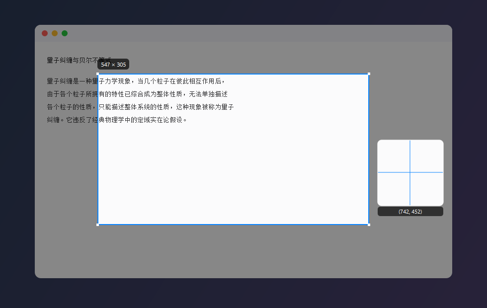

<h1 align="center">Knocknock</h1>

<p align="center">
  <b>Select text or grab a screenshot anywhere on screen, press the trigger key twice, ask a large language model.</b><br>
  A small, fast Windows desktop utility built with PySide6.
</p>

<p align="center">
  
  
  
  
  <a href="LICENSE"></a>
</p>

---

<p align="center">
  
</p>

<div align="center">
  <table>
    <tr>
      <td align="center" width="50%"><b>Dark theme</b><br></td>
      <td align="center" width="50%"><b>Narrow panel (chips wrap, none are dropped)</b><br></td>
    </tr>
    <tr>
      <td align="center"><b>Wide panel</b><br></td>
      <td align="center"><b>Settings dialog</b><br></td>
    </tr>
  </table>
  <p></p>
  <p><b>Capture mode</b> — drag a region on the dimmed desktop; a magnifier and a live size readout follow the cursor.</p>
</div>

<p align="center"><sub>Real interface renders produced by offscreen painting; the originals live in <code>screenshots/</code>.</sub></p>

---

**Contents**: [1. Features](#1-features) · [2. Getting started](#2-getting-started) · [3. Controls](#3-controls) · [4. Project structure](#4-project-structure)

---

## 1. Features

| Capability | Description |
| --- | --- |
| Text-selection Q&A | Select text with the mouse in any application, press the **trigger key twice**, and the panel opens with the selection loaded |
| Configurable trigger | The double-tap key is **any single key you choose** — Alt, Ctrl, Shift, CapsLock, F5, `a`, anything. Settings → Behavior → Double-tap key |
| Double-tap toggle | When the panel is already open, **pressing the trigger key twice again hides it**. You can turn this off in Settings and go back to "always re-read the selection" |
| Screenshot region | **Ctrl + Alt + A** (or the tray menu) opens a full-screen overlay; drag to select any region, with a pixel magnifier and live size readout |
| Screenshot sizing | The panel grows around the captured picture instead of squeezing it — but the preview is **capped at 400 px wide** (default 320 px), with small / medium / large under Settings → Appearance |
| Prompt input | Type freely in the panel's input box, or click a preset chip (Translate / Explain / Summarize / Polish / Explain code) |
| Follow-up questions | Keep asking about the same selection; the conversation context is preserved |
| Streaming answers | Text appears token by token and can be stopped at any time; results render Markdown and copy in one click |
| Free resizing | Drag the panel edge or the bottom-right corner. **Every preset chip wraps automatically and stays fully visible**, the title bar is **pinned to the top of the card**, and the size is remembered |
| Chinese / English UI | Settings → Appearance → Interface language switches everything at once — panel, tray menu, settings dialog, capture hints, and model error messages. Presets are stored separately per language |
| Light / dark theme | One-click toggle in the title bar, or follow the system. Changing it in Settings previews live |
| Always on top | The pin button in the title bar toggles it; the panel can be dragged anywhere |
| Model backends | OpenAI-compatible protocol (OpenAI / DeepSeek / Qwen / Kimi / Zhipu / Ollama …) plus Anthropic Claude |
| Separate text / vision models | Text questions and screenshots can use different models (`deepseek-chat` for text, `qwen-vl-max` for pictures); one model can still do both |
| Vision Q&A | A screenshot is sent to the model as an image (gpt-4o, qwen-vl-max, glm-4v …) |
| Generous output budget | 4096 output tokens by default, so long answers are not cut off mid-sentence; set it to 0 to let the server decide |

---

## 2. Getting started

> **Requirements:** Windows 10 or newer, Python 3.9+, and an API key from any OpenAI-compatible provider (or Anthropic). No admin rights are needed.

### 2.1 Install dependencies

```bash
cd D:\AI\Knocknock
python -m venv .venv
.venv\Scripts\activate
pip install -r requirements.txt
```

> The default install is `PySide6-Essentials` (~60 MB, only QtCore / QtGui / QtWidgets — enough for this project).
> For the full package, replace the first line of `requirements.txt` with `PySide6>=6.6.0`; no code changes are needed.
> On a slow connection in China, add a mirror: `pip install -r requirements.txt -i https://pypi.tuna.tsinghua.edu.cn/simple`

### 2.2 Launch

Double-click `run.bat` (it creates the virtual environment if needed, then starts the app), or run:

```bash
.venv\Scripts\pythonw.exe main.py
```

> Use `pythonw.exe` to avoid a console window. During debugging, run `python main.py` so you can see the logs.

### 2.3 Configure the API key

On first launch, right-click the Knocknock icon in the system tray → **Settings…** → fill in `Base URL`, `API Key`, and the model(s), click **Test connection** to confirm, then save.

There are two model fields: **Text model** for typed questions and **Vision model** for anything carrying a screenshot. Leave the vision model empty and one model does both jobs.

You can also edit `config.json` directly with a text editor (it is generated on first run):

```json
{
  "api": {
    "provider": "openai",
    "base_url": "https://api.deepseek.com/v1",
    "api_key": "sk-your-key",
    "model": "deepseek-chat",
    "vision_model": "qwen-vl-max",
    "max_tokens": 4096
  }
}
```

Reference values for common providers:

| Provider | Base URL | Model examples |
| --- | --- | --- |
| OpenAI | `https://api.openai.com/v1` | `gpt-4o-mini`, `gpt-4o` (vision) |
| DeepSeek | `https://api.deepseek.com/v1` | `deepseek-chat` |
| Alibaba Qwen | `https://dashscope.aliyuncs.com/compatible-mode/v1` | `qwen-plus`, `qwen-vl-max` (vision) |
| Moonshot | `https://api.moonshot.cn/v1` | `moonshot-v1-8k` |
| Zhipu | `https://open.bigmodel.cn/api/paas/v4` | `glm-4-flash`, `glm-4v` (vision) |
| Local Ollama | `http://localhost:11434/v1` | `qwen2.5:7b` |

> **Note:** screenshot Q&A requires a model that accepts image input. With a text-only model, use text selection instead, or switch to a vision model (`vl` / `4o` / `4v`).

---

## 3. Controls

| Action | Effect |
| --- | --- |
| Select text, then press the **trigger key twice** | Read the selection and open the panel |
| Press the **trigger key twice** while the panel is open | Hide the panel (can be disabled under Settings → Behavior) |
| **Ctrl + Alt + A** | Enter screenshot-region mode |
| **Ctrl + Alt + Q** | Same as double-tapping the trigger key |
| **Enter** in the panel | Send |
| **Shift + Enter** | New line |
| **Esc** | Hide the panel / cancel a capture |
| Drag the panel **edge or bottom-right corner** | Resize (it cannot be dragged smaller than the content, and the size is remembered) |
| Click the **moon / sun** icon in the title bar | Switch dark / light theme |
| **Double-click the left button** while capturing | Capture the whole screen |
| **Right-click / Esc** while capturing | Cancel |
| Click the tray icon | Show / hide the panel |
| Tray menu → **Close panel** | Dismiss the floating panel |
| Settings → Appearance → **Interface language** | Switch between Simplified Chinese and English (applies after saving) |
| Settings → Appearance → **Screenshot size** | How wide the captured preview may be: small 240 px / medium 320 px / large 400 px (hard ceiling) |

> **Which key should the trigger be?** It is a setting (`Settings → Behavior → Double-tap key`),
> and the trade-off moves with the choice. Ctrl is held down to multi-select files in Explorer and
> for a great many editing shortcuts, so a stray double press is easy to produce by accident; a
> lone Alt press opens an application's menu bar (the system menu, or the ribbon in Explorer), so
> double-tapping Alt may flash that menu; and a letter or digit key also fires while you type that
> character twice. Pick whichever you are least likely to hit by accident — a rarely used function
> key or CapsLock is often the calmest choice.
>
> Knocknock only *observes* the key — it never swallows it — so none of these side effects can be
> suppressed without breaking ordinary usage of that key everywhere.

---

## 4. Project structure

```
Knocknock/
├── main.py                    # Entry point: tray, hotkeys, wiring the modules together
├── run.bat                    # One-click launcher
├── pyproject.toml             # Packaging metadata and dependencies
├── requirements.txt
├── LICENSE                    # MIT
├── config.example.json        # Template with default configuration
├── config.json                # Your configuration (generated on first run, git-ignored)
├── packaging/
│   ├── build.bat              # One-command build -> dist\Knocknock.exe
│   ├── knocknock.spec         # PyInstaller build definition
│   └── make_icon.py           # Generates packaging\knocknock.ico from the vector icon
├── screenshots/               # Interface previews
├── tests/
│   └── selftest.py            # Self-test: python tests\selftest.py (18 groups, 24 cases, offline)
└── knocknock/
    ├── __init__.py            # Package version
    ├── i18n.py                # Chinese/English string tables + language state (t() / text())
    ├── config.py              # Config load/merge, presets stored per language
    ├── theme.py               # Two Apple-style palettes (light/dark) + QSS generation
    ├── winapi.py              # ctypes wrappers: SendInput / clipboard sequence / hotkey parsing
    ├── hotkey.py              # Global low-level keyboard hook + RegisterHotKey (own thread loop)
    ├── selection.py           # Text grab (simulated Ctrl+C + clipboard comparison)
    ├── capture.py             # Full-screen overlay, magnifier, cropping, PNG encoding
    ├── llm.py                 # OpenAI-compatible / Anthropic calls with streaming parsing
    ├── widgets.py             # Flow layout, vector icons, rounded thumbnails, shrinkable labels
    ├── panel.py               # Main floating panel (core UI: resize / theme / language / streaming)
    └── settings_dialog.py     # Settings dialog
```
